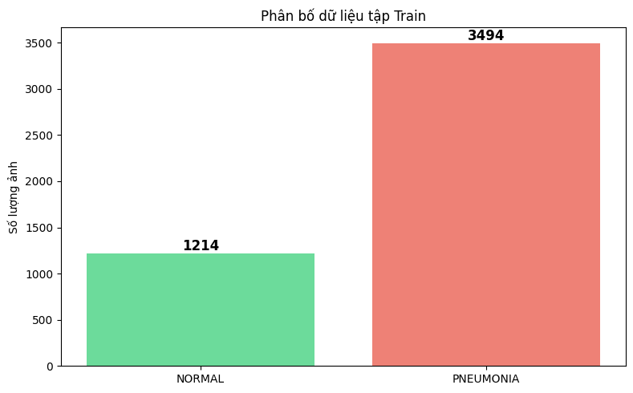

# 🫁 Phát Hiện Viêm Phổi Từ Ảnh X-Ray

Dự án này phát triển một mô hình deep learning CNN để phân loại hình ảnh X-ray phổi thành 2 lớp: **NORMAL** (phổi bình thường) và **PNEUMONIA** (phổi viêm phổi).

## 🎯 Mục Tiêu Dự Án

- ✅ Xây dựng và huấn luyện mô hình CNN baseline hiệu quả
- ✅ Đạt độ chính xác cao trong việc phát hiện viêm phổi
- ✅ Triển khai Grad-CAM để giải thích quyết định của mô hình
- ✅ Phân tích sâu các chỉ số Precision, Recall, F1-Score
- ✅ Xử lý dữ liệu mất cân bằng bằng Class Weights

## 📊 Dữ Liệu

### Nguồn Dữ Liệu
- **Dataset**: [Kaggle Chest X-Ray Images (Pneumonia)](https://www.kaggle.com/datasets/paultimothymooney/chest-xray-pneumonia)
- **Tổng số ảnh**: ~5,800 ảnh X-ray
- **Định dạng**: JPEG grayscale, kích thước 224×224 pixels
- **Lớp**: 2 lớp (NORMAL vs PNEUMONIA)
- **Tác giả Dataset**: Paul Mooney

### Phân Bố Dữ Liệu

| Tập | NORMAL | PNEUMONIA | Tổng |
|-----|--------|-----------|------|
| **Train** | ~3,300 | ~3,300 | ~6,600 |
| **Validation** | ~370 | ~370 | ~740 |
| **Test** | ~390 | ~390 | ~780 |



### Xử Lý Dữ Liệu Mất Cân Bằng

Sử dụng **Class Weights** để cân bằng 2 lớp:
- **NORMAL (Class 0)**: 1.939
- **PNEUMONIA (Class 1)**: 0.674

Phương pháp này tự động cân bằng ảnh hưởng của mỗi lớp trong quá trình huấn luyện mà không làm mất dữ liệu.

## 🧠 Kiến Trúc Mô Hình

### Baseline CNN
Mô hình bao gồm:

**4 Conv Blocks** (mỗi block):
- 2 × Conv2D layers (32 → 64 → 128 → 256 filters)
- BatchNormalization (chuẩn hóa đầu ra)
- MaxPooling2D (2×2) - giảm chiều
- Dropout (0.25) - tránh overfitting

**Dense Layers**:
- Flatten - chuyển từ 2D sang 1D
- Dense(512, relu) + BatchNorm + Dropout(0.5)
- Dense(256, relu) + BatchNorm + Dropout(0.5)
- Dense(1, sigmoid) → Output (0 = NORMAL, 1 = PNEUMONIA)

### Thông Số Mô Hình

| Thuộc Tính | Giá Trị |
|-----------|--------|
| **Input Shape** | 224 × 224 × 1 (grayscale) |
| **Total Parameters** | 27,000,801 |
| **Batch Size** | 32 |
| **Epochs Trained** | 42 |
| **Optimizer** | Adam (learning rate = 0.001) |
| **Loss Function** | Binary Crossentropy |
| **Early Stopping** | Yes (patience=10 on val_auc) |
| **Regularization** | Dropout + BatchNormalization |

## 📈 Kết Quả Training & Đánh Giá

### Hiệu Suất Trên Test Set

| Chỉ Số | Giá Trị |
|-------|--------|
| **Accuracy** | 85.74% |
| **Precision** | 82.65% |
| **Recall** | 97.69% |
| **AUC** | 0.9516 |
| **F1-Score** | 0.8954 |

### Confusion Matrix


Confusion matrix cho thấy:
- **True Negatives (TN)**: Số ảnh NORMAL được dự đoán chính xác
- **True Positives (TP)**: Số ảnh PNEUMONIA được dự đoán chính xác
- **False Positives (FP)**: Số ảnh NORMAL bị dự đoán sai là PNEUMONIA
- **False Negatives (FN)**: Số ảnh PNEUMONIA bị dự đoán sai là NORMAL (rất ít - chỉ 2.31%)

### Giải Thích Chi Tiết Các Chỉ Số

**📊 Accuracy (Độ Chính Xác)**
- Tỷ lệ dự đoán đúng trên tổng số dự đoán
- **85.74%** = Mô hình dự đoán đúng 85.74% test cases

**✅ Precision (Độ Chính Xác Dự Đoán Dương Tính)**
- Trong số những ảnh mô hình dự đoán là "PNEUMONIA", **82.65%** thực sự mắc viêm phổi
- **Ý nghĩa**: Khi mô hình cảnh báo "viêm phổi", bạn có thể tin tưởng 82.65%
- **Ứng dụng**: Tránh cảnh báo sai alarm quá nhiều

**🔍 Recall (Độ Nhạy / Sensitivity)**
- Trong số những ảnh thực sự mắc "PNEUMONIA", mô hình phát hiện được **97.69%**
- **Ý nghĩa**: Mô hình rất ít bỏ sót các ca bệnh thực tế (chỉ bỏ sót ~2.31%)
- **Quan trọng trong y tế**: Recall cao giảm nguy hiểm bỏ sót bệnh
- **Trade-off**: Để có Recall cao, mô hình phải "dễ dãi" hơn, dẫn đến một số cảnh báo sai (Precision thấp hơn)

**🎯 AUC (Area Under Curve)**
- **0.9516** cho biết mô hình có khả năng phân biệt 2 lớp rất tốt
- Giá trị càng gần 1.0 càng tốt

**⚖️ F1-Score**
- **0.8954** là trung bình điều hòa của Precision và Recall
- Đưa ra một đánh giá cân bằng về hiệu suất mô hình
- Phù hợp khi muốn xem xét cả 2 metric

## 📈 ROC Curve & AUC Analysis

### ROC Curve (Receiver Operating Characteristic)
Đường cong ROC hiển thị sự cân bằng giữa **True Positive Rate (Recall)** và **False Positive Rate** khi thay đổi threshold dự đoán.


### Giải Thích ROC Curve

**📊 AUC (Area Under Curve) = 0.9516**
- **Ý nghĩa**: Model có xác suất **95.16%** sẽ xếp hạng một ảnh PNEUMONIA cao hơn một ảnh NORMAL
- **Giá trị tuyệt vời**: 
  - 0.5 = Random (không tốt hơn ngẫu nhiên)
  - 0.7 - 0.8 = Tốt
  - 0.8 - 0.9 = Rất tốt
  - 0.9 - 1.0 = Xuất sắc ✓

**🎯 Optimal Point**
- Điểm tối ưu được đánh dấu trên đường cong (optimal threshold ≈ 0.946)
- Tại điểm này, model đạt cân bằng tốt nhất giữa:
  - TPR (True Positive Rate) = Recall cao
  - FPR (False Positive Rate) = Cảnh báo sai thấp

**📍 Diagonal Line (Random Classifier)**
- Đường chéo màu đỏ đứt nét biểu diễn classifier ngẫu nhiên (AUC = 0.5)
- Model của chúng ta nằm **rất cao trên đường chéo** ✓ → Hiệu suất vượt trội

### Ứng Dụng trong Y Tế
- **AUC cao** → Model phân biệt NORMAL và PNEUMONIA rất tốt
- **Không quan tâm tới False Positive Rate** → Có thể dùng khi cần Recall cao
- **Phù hợp khi data imbalanced** → Không bị ảnh hưởng bởi mất cân bằng lớp

## 📦 Kỹ Thuật Huấn Luyện

### Early Stopping & Learning Rate Reduction
- **Early Stopping**: Ngừng training khi `val_auc` không cải thiện trong 10 epoch liên tiếp
- **ReduceLROnPlateau**: Giảm learning rate khi loss không giảm
- **ModelCheckpoint**: Tự động lưu best model dựa trên val_auc cao nhất

### Data Augmentation (Tăng Cường Dữ Liệu)
- Rotation ±10 độ
- Width/Height shift: ±10%
- Shear: ±10%
- Zoom: ±20%
- Horizontal flip: Disabled (không lật ngang, vì X-ray y tế cần giữ nguyên)

Kỹ thuật này giúp mô hình tổng quát hóa tốt hơn và tránh overfitting trên tập training nhỏ.

## 🔍 Grad-CAM: Giải Thích Quyết Định Mô Hình

**Grad-CAM** (Gradient-weighted Class Activation Mapping) là kỹ thuật để trực quan hóa vùng ảnh mà mô hình tập trung để đưa ra quyết định.

### Ý Nghĩa
- Giúp hiểu mô hình "nhìn" vào đâu
- Xác định các dấu hiệu y tế quan trọng
- Tăng độ tin cậy khi áp dụng model trong thực tế

### Kết Quả
Notebook `Grad_CAM.ipynb` hiển thị:
- Heatmap các vùng quan trọng trên ảnh PNEUMONIA
- Giúp bác sĩ xác nhận quyết định của mô hình
- Model tập trung vào các vùng có dấu hiệu bệnh lý


## 📊 Phân Tích Precision vs Recall

### Trade-off Giữa 2 Chỉ Số

**Precision ↑ (Độ Chính Xác Cao)**
- Mô hình "thận trọng" → chỉ dự đoán PNEUMONIA khi rất chắc chắn
- Ít cảnh báo sai ✓
- Nhưng bỏ sót nhiều ca bệnh ✗

**Recall ↑ (Độ Nhạy Cao)**
- Mô hình "dễ dãi" → dự đoán PNEUMONIA nếu có khả năng
- Phát hiện hầu hết ca bệnh ✓
- Nhưng có nhiều cảnh báo sai ✗

### Lựa Chọn Trong Y Tế

**Trong ứng dụng phát hiện bệnh, Recall được ưu tiên hơn Precision**

Tại sao?
- **Chi phí bỏ sót bệnh**: Rất cao (bệnh nhân không được chữa trị)
- **Chi phí cảnh báo sai**: Thấp hơn (bệnh nhân có thể kiểm tra thêm)

**Mô hình này đạt được:**
- Recall = 97.69% ✓ (Phát hiện gần như tất cả ca bệnh)
- Precision = 82.65% ✓ (Cảnh báo sai có kiểm soát)
- F1-Score = 0.8954 ✓ (Cân bằng tốt)


## 🚀 Hướng Dẫn Nhanh Chạy Dự Án

### 1️⃣ Chuẩn Bị Môi Trường

```bash
# Cài đặt dependencies
pip install -r requirements.txt
```

### 2️⃣ Chạy Ứng Dụng Web

```bash
# Khởi động Streamlit app
streamlit run app.py
```
Ứng dụng sẽ mở tại `http://localhost:8501`

### 3️⃣ Khám Phá Notebooks

Mở các Jupyter Notebooks trong thư mục `notebooks/`:
- **`notebook.ipynb`** - Training model CNN từ đầu
- **`Grad_CAM.ipynb`** - Trực quan hóa Grad-CAM (giải thích quyết định)
- **`AUC.ipynb`** - Phân tích ROC Curve & AUC
- **`pre_rec.ipynb`** - Phân tích Precision vs Recall
- **`push_model2hf.ipynb`** - Đẩy model lên Hugging Face

## 💡 Các Điểm Chính & Kết Luận

### 1. Hiệu Suất Mô Hình
✅ **Recall rất cao (97.69%)** → Phát hiện được hầu hết các ca bệnh  
✅ **Precision tốt (82.65%)** → Cảnh báo được kiểm soát  
✅ **AUC vượt trội (0.9516)** → Khả năng phân biệt 2 lớp xuất sắc  
✅ **Cân bằng giữa sensitivity & specificity** → Phù hợp cho y tế

### 2. Xử Lý Dữ Liệu Mất Cân Bằng
✅ **Class Weights hiệu quả** → Tự động cân bằng 2 lớp  
✅ **Giữ nguyên dữ liệu** → Không mất thông tin  
✅ **Phù hợp bối cảnh y tế** → Sử dụng mọi ca lâm sàng

### 3. Regularization & Overfitting Prevention
✅ **Dropout + BatchNormalization** → Tránh overfitting  
✅ **Early Stopping** → Dừng tại điểm tối ưu (epoch 42)  
✅ **Data Augmentation** → Tăng tính tổng quát hóa  

### 4. Model Explainability
✅ **Grad-CAM visualization** → Giải thích quyết định model  
✅ **Precision-Recall analysis** → Hiểu các trade-off  
✅ **Transparency** → Tin tưởng model trong y tế

## 🔄 Quy Trình Dự Án

**Chuẩn bị dữ liệu** → **Xây dựng model** → **Huấn luyện** → **Đánh giá** → **Phân tích** → **Triển khai**

1. **Chuẩn bị dữ liệu** (notebook.ipynb)
   - Load dataset Kaggle
   - Chia train/val 9:1
   - Phân tích và trực quan hóa

2. **Xây dựng & Huấn Luyện** (notebook.ipynb)
   - Thiết kế CNN architecture
   - Compile với metrics y tế
   - Training với class weights

3. **Đánh Giá & Phân Tích** (notebook.ipynb, Grad_CAM.ipynb, pre_rec.ipynb)
   - Test set evaluation
   - Confusion matrix
   - Grad-CAM visualization
   - Precision/Recall trade-off

## 📚 Tài Liệu Tham Khảo

### Dataset
- [Kaggle: Chest X-Ray Images (Pneumonia)](https://www.kaggle.com/datasets/paultimothymooney/chest-xray-pneumonia)
- [Original Research Paper](https://www.cell.com/cell/fulltext/S0092-8674(18)30154-5)

### CNN & Deep Learning
- [Convolutional Neural Networks: Architectures, Mechanisms, and Applications](https://arxiv.org/abs/2010.07468)
- [A Guide to Convolutional Neural Networks](https://arxiv.org/abs/1808.04752)
- [VGG Networks: Deep Convolutional Networks for Large-Scale Image Recognition](https://arxiv.org/abs/1409.1556)

### Model Interpretability
- [Grad-CAM: Visual Explanations from Deep Networks via Gradient-based Localization](https://arxiv.org/abs/1610.02055)
- [Interpretable Explanations of Black Boxes by Meaningful Perturbation](https://arxiv.org/abs/1506.02390)

### Framework & Tools
- [TensorFlow/Keras Documentation](https://www.tensorflow.org/)
- [Keras API Reference - Class Weights](https://keras.io/api/models/sequential/#fit)
- [Scikit-learn: Machine Learning Library](https://scikit-learn.org/)

## ⚠️ Lưu Ý Quan Trọng

### 🔴 Disclaimer
Mô hình này được phát triển cho mục đích **học tập và nghiên cứu**.  
**KHÔNG nên sử dụng trực tiếp trong chẩn đoán y tế thực tế**.  
Bất kỳ quyết định y tế phải được xác nhận bởi chuyên gia y tế được đào tạo.

### 📌 Giới Hạn Mô Hình
- Chỉ được huấn luyện trên dataset Kaggle
- Kích thước ảnh cố định 224×224 pixels
- Chỉ phân loại binary (NORMAL vs PNEUMONIA)
- Có thể không tổng quát hóa tốt trên dữ liệu từ các bệnh viện khác

### ✅ Cách Sử Dụng An Toàn
- **Sử dụng như công cụ hỗ trợ** quyết định, không thay thế bác sĩ
- **Luôn kết hợp** với chẩn đoán lâm sàng của chuyên gia
- **Kiểm tra Confidence Score** trước khi áp dụng
- **Đặc biệt chú ý** đến False Negatives (bỏ sót bệnh)

### 🏥 Khuyến Nghị Sử Dụng
1. Coi model như "second opinion" tool
2. Khi model dự đoán "NORMAL" với Confidence < 80% → Khuyến cáo kiểm tra lại
3. Khi model dự đoán "PNEUMONIA" → Yêu cầu xác nhận từ bác sĩ
4. Ghi nhận tất cả kết quả cho lý lịch bệnh nhân

## 📝 Thông Tin Dự Án

- **Ngày Tạo**: 18 tháng 11 năm 2025
- **Model Timestamp**: 20251118_091549
- **Mục Đích**: Giáo dục & Nghiên Cứu
- **Dataset**: Kaggle Chest X-Ray Images (Pneumonia)
- **Framework**: TensorFlow/Keras
- **GPU**: NVIDIA P100 (nếu có)

---

**"Phòng ngừa hơn chữa trị" - Mô hình này là công cụ hỗ trợ, không thay thế bác sĩ** 🏥
