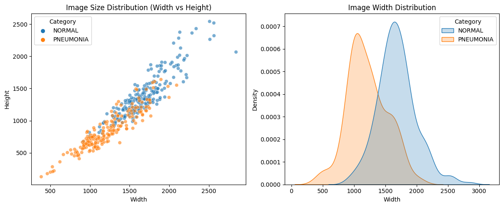
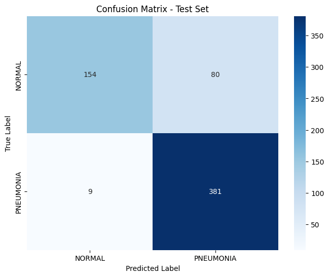
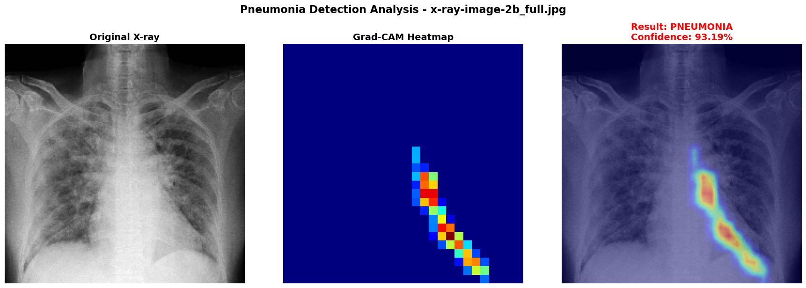

# 🫁 Phát hiện viêm phổi từ ảnh Chest X-Ray

Dự án này phát triển một mô hình CNN học sâu để phân loại ảnh chest X-ray thành 2 lớp: **BÌNH THƯỜNG** (phổi khỏe mạnh) và **VIÊM PHỔI** (phổi bị viêm phổi).

## 🎯 Mục tiêu Dự án

- ✅ Xây dựng và huấn luyện một mô hình CNN baseline hiệu quả
- ✅ Đạt độ chính xác cao trong việc phát hiện viêm phổi
- ✅ Triển khai Grad-CAM để giải thích quyết định mô hình
- ✅ Thực hiện phân tích chuyên sâu các chỉ số Precision, Recall và F1-Score
- ✅ Xử lý mất cân bằng dữ liệu bằng Class Weights

## 📊 Tập dữ liệu

### Nguồn dữ liệu
- **Tập dữ liệu**: [Kaggle Chest X-Ray Images (Pneumonia)](https://www.kaggle.com/datasets/paultimothymooney/chest-xray-pneumonia)
- **Tổng số ảnh**: ~5,800 ảnh X-ray
- **Định dạng**: JPEG grayscale, kích thước 224×224 pixels
- **Lớp**: 2 lớp (BÌNH THƯỜNG vs VIÊM PHỔI)


### Phân bố Dữ liệu


#### Tập dữ liệu Gốc (Trước khi chia Train/Val)

| Split/Danh mục | Train | Val | Test | **Tổng cộng** |
|:---|:---|:---|:---|:---|
| **BÌNH THƯỜNG** | 1,341 | 8 | 234 | **1,583** |
| **VIÊM PHỔI** | 3,875 | 8 | 390 | **4,273** |
| **Tổng cộng** | **5,216** | **16** | **624** | **5,856** |

#### Sau khi Chia lại Train/Val (Phân bố Cuối cùng)

| Split/Danh mục | Train | Val | Test | **Tổng cộng** |
|:---|:---|:---|:---|:---|
| **BÌNH THƯỜNG** | 1,214 | 135 | 234 | **1,583** |
| **VIÊM PHỔI** | 3,494 | 389 | 390 | **4,273** |
| **Tổng cộng** | **4,708** | **524** | **624** | **5,856** |

**Các thay đổi chính:**
- ✅ Tăng tập validation từ 16 lên 524 ảnh để đánh giá mô hình tốt hơn
- ✅ Duy trì tập test ở 624 ảnh để đánh giá hiệu suất nhất quán
- ✅ Phân bố lại tập training thành 4,708 ảnh với đại diện cân bằng
- ✅ Kích thước tập validation tốt hơn giúp phát hiện overfitting đáng tin cậy hơn

### Phân bố Kích thước Ảnh



Tất cả các ảnh X-ray trong tập dữ liệu được chuẩn hóa thành **224×224 pixels** ở định dạng grayscale (1 channel). Kích thước đồng nhất này đảm bảo:
- ✅ Đầu vào nhất quán cho mô hình CNN
- ✅ Giảm yêu cầu bộ nhớ trong quá trình huấn luyện
- ✅ Xử lý batch hiệu quả
- ✅ Cải thiện khả năng tổng quát hóa của mô hình

### Phân bố Cường độ Điểm ảnh (Pixel Intensity)


Ảnh X-ray thể hiện các mẫu cường độ pixel tương tự giữa các lớp BÌNH THƯỜNG và VIÊM PHỔI, nhưng với những khác biệt tinh tế:
- **Ảnh BÌNH THƯỜNG**: Phân bố cường độ đồng nhất hơn với phương sai thấp hơn
- **Ảnh VIÊM PHỔI**: Biến động cường độ cao hơn ở các vùng phổi bị ảnh hưởng
- Phân bố này được chuẩn hóa trong quá trình tiền xử lý để cải thiện huấn luyện mô hình

### Xử lý Mất cân bằng Dữ liệu

Sử dụng **Class Weights** để cân bằng 2 lớp:
- **BÌNH THƯỜNG (Lớp 0)**: 1.939
- **VIÊM PHỔI (Lớp 1)**: 0.674

Phương pháp này tự động cân bằng ảnh hưởng của mỗi lớp trong quá trình huấn luyện mà không mất dữ liệu.

## 🧠 Kiến trúc Mô hình

### CNN Baseline
Mô hình bao gồm:

**4 Conv Blocks** (mỗi block):
- 2 × Conv2D layers (32 → 64 → 128 → 256 filters)
- BatchNormalization (chuẩn hóa đầu ra)
- MaxPooling2D (2×2) - giảm kích thước
- Dropout (0.25) - ngăn overfitting

**Dense Layers**:
- Flatten - chuyển từ 2D thành 1D
- Dense(512, relu) + BatchNorm + Dropout(0.5)
- Dense(256, relu) + BatchNorm + Dropout(0.5)
- Dense(1, sigmoid) → Đầu ra (0 = BÌNH THƯỜNG, 1 = VIÊM PHỔI)

### Thông số Mô hình

| Thuộc tính | Giá trị |
|-----------|-------|
| **Input Shape** | 224 × 224 × 1 (grayscale) |
| **Tổng thông số** | 27,000,801 |
| **Batch Size** | 32 |
| **Epoch Huấn luyện** | 42 |
| **Optimizer** | Adam (learning rate = 0.001) |
| **Hàm Loss** | Binary Crossentropy |
| **Early Stopping** | Có (patience=10 trên val_auc) |
| **Regularization** | Dropout + BatchNormalization |

## 📈 Kết quả Huấn luyện & Đánh giá

### Hiệu suất trên Tập Test

| Chỉ số | Giá trị |
|--------|-------|
| **Accuracy** | 85.74% |
| **Precision** | 82.65% |
| **Recall** | 97.69% |
| **AUC** | 0.9516 |
| **F1-Score** | 0.8954 |

### Confusion Matrix



Confusion matrix cho thấy:
- **True Negatives (TN)**: Số lượng ảnh BÌNH THƯỜNG được dự đoán chính xác
- **True Positives (TP)**: Số lượng ảnh VIÊM PHỔI được dự đoán chính xác
- **False Positives (FP)**: Số lượng ảnh BÌNH THƯỜNG được dự đoán sai thành VIÊM PHỔI
- **False Negatives (FN)**: Số lượng ảnh VIÊM PHỔI được dự đoán sai thành BÌNH THƯỜNG (rất ít - chỉ 2.31%)

### Giải thích Chi tiết Chỉ số

**📊 Accuracy (Độ chính xác Tổng thể)**
- Tỷ lệ giữa dự đoán đúng và tổng dự đoán
- **85.74%** = Mô hình dự đoán chính xác 85.74% trường hợp test

**✅ Precision (Độ Chính xác Dương tính)**
- Trong số các ảnh mô hình dự đoán là "VIÊM PHỔI", **82.65%** thực sự có viêm phổi
- **Ý nghĩa**: Khi mô hình cảnh báo "viêm phổi", bạn có thể tin tưởng 82.65%
- **Ứng dụng**: Tránh quá nhiều cảnh báo sai

**🔍 Recall (Độ nhạy)**
- Trong số các ảnh thực sự mắc "VIÊM PHỔI", mô hình phát hiện **97.69%**
- **Ý nghĩa**: Mô hình hiếm khi bỏ sót trường hợp thực tế (chỉ bỏ sót ~2.31%)
- **Quan trọng trong Y tế**: Recall cao giảm rủi ro bỏ lỡ bệnh
- **Cân bằng**: Để đạt Recall cao, mô hình phải "khoan dung" hơn, dẫn đến một số cảnh báo sai (Precision thấp hơn)

**🎯 AUC (Area Under Curve)**
- **0.9516** chỉ ra mô hình có khả năng phân biệt 2 lớp xuất sắc
- Giá trị gần 1.0 hơn càng tốt

**⚖️ F1-Score**
- **0.8954** là trung bình điều hòa của Precision và Recall
- Cung cấp đánh giá cân bằng về hiệu suất mô hình
- Phù hợp khi cân nhắc cả hai chỉ số bằng nhau

## 📈 Đường cong ROC & Phân tích AUC

### Đường cong ROC (Receiver Operating Characteristic)
Đường cong ROC hiển thị sự cân bằng giữa **True Positive Rate (Recall)** và **False Positive Rate** khi ngưỡng dự đoán thay đổi.


### Giải thích Đường cong ROC

**📊 AUC (Area Under Curve) = 0.9516**
- **Ý nghĩa**: Mô hình có **95.16%** xác suất xếp hạng ảnh VIÊM PHỔI cao hơn ảnh BÌNH THƯỜNG
- **Giá trị Xuất sắc**: 
  - 0.5 = Ngẫu nhiên (không tốt hơn may rủi)
  - 0.7 - 0.8 = Tốt
  - 0.8 - 0.9 = Rất tốt
  - 0.9 - 1.0 = Xuất sắc ✓

**🎯 Điểm Tối ưu**
- Điểm tối ưu được đánh dấu trên đường cong (ngưỡng tối ưu ≈ 0.946)
- Tại điểm này, mô hình đạt sự cân bằng tốt nhất giữa:
  - TPR (True Positive Rate) = Recall cao
  - FPR (False Positive Rate) = Cảnh báo sai thấp

**📍 Đường chéo (Bộ phân loại Ngẫu nhiên)**
- Đường chéo đỏ đứt nét đại diện cho bộ phân loại ngẫu nhiên (AUC = 0.5)
- Mô hình của chúng ta nằm **cao trên đường chéo** ✓ → Hiệu suất vượt trội

### Ứng dụng Y tế
- **AUC cao** → Mô hình phân biệt BÌNH THƯỜNG và VIÊM PHỔI xuất sắc
- **Bỏ qua False Positive Rate** → Có thể sử dụng khi cần Recall cao
- **Phù hợp với dữ liệu mất cân bằng** → Không bị ảnh hưởng bởi mất cân bằng lớp

## 📦 Kỹ thuật Huấn luyện

### Early Stopping & Giảm Learning Rate
- **Early Stopping**: Dừng huấn luyện khi `val_auc` không cải thiện trong 10 epoch liên tiếp
- **ReduceLROnPlateau**: Giảm learning rate khi loss plateaus
- **ModelCheckpoint**: Tự động lưu mô hình tốt nhất dựa trên val_auc cao nhất

### Data Augmentation
- Xoay ±10 độ
- Dịch chuyển chiều rộng/cao: ±10%
- Shear: ±10%
- Zoom: ±20%
- Lật ngang: Tắt (không lật, ảnh X-ray y tế phải giữ nguyên hướng)

Kỹ thuật này giúp mô hình tổng quát hóa tốt hơn và ngăn overfitting trên các tập dữ liệu huấn luyện nhỏ.

## 🔍 Grad-CAM: Giải thích Quyết định Mô hình

**Grad-CAM** (Gradient-weighted Class Activation Mapping) là kỹ thuật để trực quan hóa các vùng ảnh mà mô hình tập trung vào để đưa ra quyết định.

### Ý nghĩa
- Giúp hiểu mô hình "nhìn" vào đâu
- Xác định các chỉ dấu y tế quan trọng
- Tăng độ tin cậy khi áp dụng mô hình trong thực tế

### Kết quả
Notebook `Grad_CAM.ipynb` hiển thị:
- Bản đồ nhiệt của các vùng quan trọng trên ảnh VIÊM PHỔI
- Giúp bác sĩ xác nhận quyết định mô hình
- Mô hình tập trung vào các vùng cho thấy dấu hiệu bệnh



## 📊 Phân tích Precision vs Recall

### Sự cân bằng giữa 2 Chỉ số

**Precision ↑ (Độ chính xác cao)**
- Mô hình "bảo thủ" → chỉ dự đoán VIÊM PHỔI khi rất tự tin
- Ít cảnh báo sai ✓
- Nhưng bỏ sót nhiều trường hợp bệnh ✗

**Recall ↑ (Độ nhạy cao)**
- Mô hình "khoan dung" → dự đoán VIÊM PHỔI nếu có khả năng
- Phát hiện hầu hết trường hợp bệnh ✓
- Nhưng tạo nhiều cảnh báo sai ✗

### Lựa chọn trong Y tế

**Trong các ứng dụng phát hiện bệnh, Recall được ưu tiên hơn Precision**

Tại sao?
- **Chi phí bỏ lỡ bệnh**: Rất cao (bệnh nhân không nhận được điều trị)
- **Chi phí cảnh báo sai**: Thấp hơn (bệnh nhân có thể kiểm tra thêm)

**Mô hình này đạt:**
- Recall = 97.69% ✓ (Phát hiện gần như tất cả trường hợp bệnh)
- Precision = 82.65% ✓ (Kiểm soát cảnh báo sai)
- F1-Score = 0.8954 ✓ (Cân bằng tốt)

## 🚀 Hướng dẫn Khởi động Nhanh

### 1️⃣ Thiết lập Môi trường

```bash
# Cài đặt các phụ thuộc
pip install -r requirements.txt
```

### 2️⃣ Chạy Ứng dụng Web

```bash
# Khởi động ứng dụng Streamlit
streamlit run app.py
```
Ứng dụng sẽ mở tại `http://localhost:8501`

### 3️⃣ Khám phá Notebooks

Mở Jupyter Notebooks trong thư mục `notebooks/`:
- **`notebook.ipynb`** - Huấn luyện mô hình CNN từ đầu
- **`Grad_CAM.ipynb`** - Trực quan hóa Grad-CAM (giải thích quyết định)
- **`AUC.ipynb`** - Phân tích Đường cong ROC & AUC
- **`pre_rec.ipynb`** - Phân tích Precision vs Recall
- **`push_model2hf.ipynb`** - Đẩy mô hình lên Hugging Face

## 💡 Các điểm Chính & Kết luận

### 1. Hiệu suất Mô hình
✅ **Recall Rất cao (97.69%)** → Phát hiện gần như tất cả trường hợp bệnh  
✅ **Precision Tốt (82.65%)** → Kiểm soát cảnh báo sai  
✅ **AUC Vượt trội (0.9516)** → Khả năng phân biệt lớp xuất sắc  
✅ **Độ nhạy & độ đặc hiệu cân bằng** → Phù hợp cho y tế

### 2. Xử lý Mất cân bằng Dữ liệu
✅ **Class Weights hiệu quả** → Tự động cân bằng 2 lớp  
✅ **Bảo toàn dữ liệu** → Không mất thông tin  
✅ **Phù hợp với bối cảnh y tế** → Sử dụng tất cả trường hợp lâm sàng

### 3. Regularization & Ngăn Overfitting
✅ **Dropout + BatchNormalization** → Ngăn overfitting  
✅ **Early Stopping** → Dừng ở điểm tối ưu (epoch 42)  
✅ **Data Augmentation** → Cải thiện tổng quát hóa  

### 4. Khả giải thích Mô hình
✅ **Trực quan hóa Grad-CAM** → Giải thích quyết định mô hình  
✅ **Phân tích Precision-Recall** → Hiểu được sự cân bằng  
✅ **Tính minh bạch** → Tin tưởng mô hình trong y tế

## 🔄 Quy trình Dự án

**Chuẩn bị Dữ liệu** → **Xây dựng Mô hình** → **Huấn luyện** → **Đánh giá** → **Phân tích** → **Triển khai**

1. **Chuẩn bị Dữ liệu** (notebook.ipynb)
   - Tải tập dữ liệu Kaggle
   - Chia train/val 9:1
   - Phân tích và trực quan hóa

2. **Xây dựng & Huấn luyện** (notebook.ipynb)
   - Thiết kế kiến trúc CNN
   - Biên dịch với các chỉ số y tế
   - Huấn luyện với class weights

3. **Đánh giá & Phân tích** (notebook.ipynb, Grad_CAM.ipynb, pre_rec.ipynb)
   - Đánh giá tập test
   - Confusion matrix
   - Trực quan hóa Grad-CAM
   - Sự cân bằng Precision/Recall

## 📚 Tài liệu Tham khảo

### Tập dữ liệu
- **Tập dữ liệu Gốc**: Kermany, Daniel; Zhang, Kang; Goldbaum, Michael (2018), "Large Dataset of Labeled Optical Coherence Tomography (OCT) and Chest X-Ray Images", Mendeley Data, V3, doi: 10.17632/rscbjbr9sj.3
- [Nguồn Mendeley Data](https://data.mendeley.com/datasets/rscbjbr9sj/2)
- [Kaggle: Chest X-Ray Images (Pneumonia)](https://www.kaggle.com/datasets/paultimothymooney/chest-xray-pneumonia)
- [Bài báo Nghiên cứu Gốc](https://www.cell.com/cell/fulltext/S0092-8674(18)30154-5)

### CNN & Học sâu
- [Convolutional Neural Networks: Architectures, Mechanisms, and Applications](https://arxiv.org/abs/2010.07468)
- [A Guide to Convolutional Neural Networks](https://arxiv.org/abs/1808.04752)
- [VGG Networks: Deep Convolutional Networks for Large-Scale Image Recognition](https://arxiv.org/abs/1409.1556)

### Khả giải thích Mô hình
- [Grad-CAM: Visual Explanations from Deep Networks via Gradient-based Localization](https://arxiv.org/abs/1610.02055)
- [Interpretable Explanations of Black Boxes by Meaningful Perturbation](https://arxiv.org/abs/1506.02390)

### Framework & Công cụ
- [TensorFlow/Keras Documentation](https://www.tensorflow.org/)
- [Keras API Reference - Class Weights](https://keras.io/api/models/sequential/#fit)
- [Scikit-learn: Machine Learning Library](https://scikit-learn.org/)

## ⚠️ Tuyên bố Miễn trừ Trách nhiệm Quan trọng

### 🔴 Tuyên bố
Mô hình này được phát triển **chỉ cho mục đích giáo dục và nghiên cứu**.  
**KHÔNG nên sử dụng trực tiếp để chẩn đoán y tế thực tế**.  
Mọi quyết định y tế phải được xác nhận bởi các chuyên gia y tế được đào tạo.

### 📌 Hạn chế Mô hình
- Chỉ được huấn luyện trên tập dữ liệu Kaggle
- Kích thước ảnh cố định 224×224 pixels
- Chỉ phân loại nhị phân (BÌNH THƯỜNG vs VIÊM PHỔI)
- Có thể không tổng quát hóa tốt cho dữ liệu từ các bệnh viện khác

### ✅ Hướng dẫn Sử dụng An toàn
- **Sử dụng như công cụ hỗ trợ quyết định**, không thay thế bác sĩ
- **Luôn kết hợp** với chẩn đoán lâm sàng chuyên gia
- **Kiểm tra Điểm tin cậy** trước khi ứng dụng
- **Tập trung đặc biệt** vào False Negatives (bệnh bị bỏ sót)

### 🏥 Khuyến cáo Sử dụng
1. Coi mô hình như công cụ "ý kiến thứ hai"
2. Khi mô hình dự đoán "BÌNH THƯỜNG" với Độ tin cậy < 80% → Khuyến cáo kiểm tra lại
3. Khi mô hình dự đoán "VIÊM PHỔI" → Yêu cầu xác nhận bác sĩ
4. Ghi lại tất cả kết quả trong hồ sơ bệnh nhân

## 📝 Thông tin Dự án

- **Ngày Tạo**: 18 Tháng 11, 2025
- **Dấu thời gian Mô hình**: 20251118_091549
- **Mục đích**: Giáo dục & Nghiên cứu
- **Tập dữ liệu**: Kaggle Chest X-Ray Images (Pneumonia)
- **Framework**: TensorFlow/Keras
- **GPU**: NVIDIA P100 (nếu có)

---

**"Phòng bệnh hơn chữa bệnh" - Mô hình này là công cụ hỗ trợ, không phải thay thế bác sĩ** 🏥
